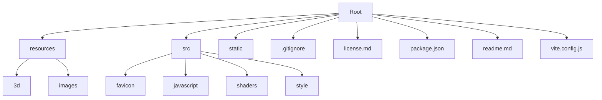

# Protafolio 2025- Portafolio Interactivo de Servicios


## ¡Bienvenido a mi Universo Digital!

Soy técnico analista, desarrollador de software y hacker ético en formación. Mi pasión por la tecnología y la seguridad de la información me impulsa a crear soluciones innovadoras. Este portafolio interactivo es una ventana a mis proyectos y habilidades, diseñado con Three.js para ofrecerte una experiencia inmersiva y profesional.

## 🔄 Características Destacadas
- **Gráficos 3D Dinámicos:** Explora visuales interactivos desarrollados con tecnologías de punta.
- **Enfoque Educativo y Visual:** Aprende sobre mis habilidades técnicas de forma intuitiva.
- **Calidad Profesional:** Diseño estructurado para clientes, colaboradores y proyectos desafiantes.

---

## 🔍 Tabla de Contenidos
1. [Instalación](#instalación)
2. [Uso](#uso)
3. [Estructura del Proyecto](#estructura-del-proyecto)
4. [Diagrama del Proyecto](#diagrama-del-proyecto)
5. [Contribuciones y Feedback](#contribuciones-y-feedback)
6. [Licencia](#licencia)

---

## 🛠️ Instalación
Configura el proyecto y explora este universo interactivo en pocos pasos:

### Requisitos Previos
- [Node.js](https://nodejs.org/en/download/) instalado en tu sistema.

### Pasos
```bash
# Clona el repositorio
git clone https://github.com/tu-usuario/folio-2019.git

# Navega al directorio del proyecto
cd folio-2019

# Instala las dependencias
npm install
```

---

## 🎮 Uso
Descubre el portafolio ejecutando el proyecto:

### Modo Desarrollo
Vive la experiencia en tiempo real:
```bash
# Inicia el servidor en localhost:1234
npm run dev
```

### Modo Producción
Optimiza el proyecto para su despliegue:
```bash
# Crea los archivos en el directorio dist/
npm run build
```

---

## 🔄 Estructura del Proyecto
La organización del proyecto permite un flujo claro y eficiente:

```
root/
├── resources/
│   ├── 3d/
│   └── images/
├── src/
│   ├── favicon/
│   ├── javascript/
│   ├── shaders/
│   └── style/
├── static/
├── .gitignore
├── license.md
├── package.json
├── readme.md
└── vite.config.js
```

---

## 🔍 Diagrama del Proyecto
Visualiza la arquitectura general del proyecto:



---

## 💬 Contribuciones y Feedback
Tu opinión importa. Si tienes ideas, sugerencias o encuentras errores, ¡házmelo saber! Puedes contribuir o contactarme:

- [GitHub](https://github.com/tu-usuario)
- [LinkedIn](https://linkedin.com/in/tu-usuario)

---

## 🛣️ Licencia
Este proyecto está protegido bajo la Licencia MIT. Consulta el archivo [LICENSE](license.md) para obtener más detalles.

---

🚀 **Gracias por explorar mi portafolio.** Espero que esta experiencia te inspire tanto como a mí desarrollarla. Si tienes un proyecto desafiante, ¡hablemos y hagámoslo realidad!

